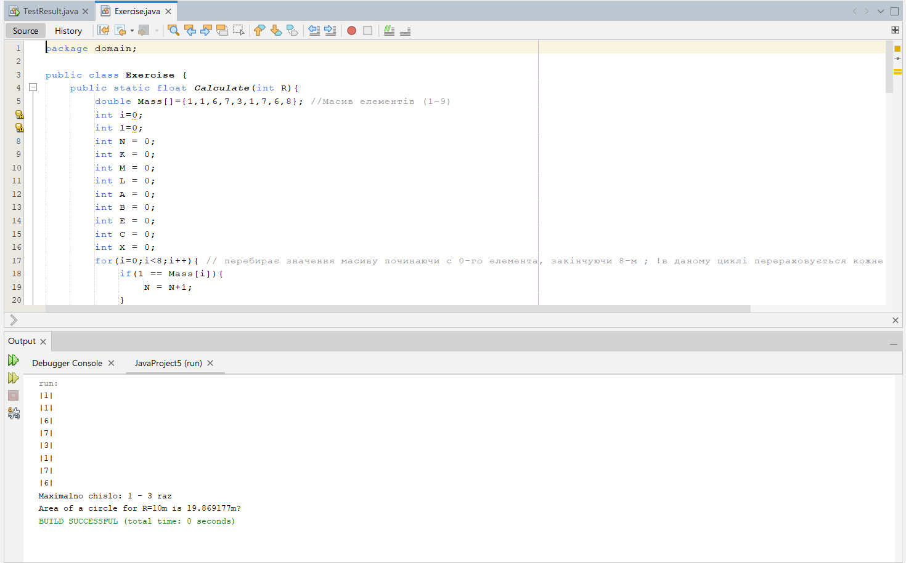

[](https://classroom.github.com/open-in-codespaces?assignment_repo_id=10111183)
# Практична робота "Масиви, вирази, керування виконанням програми"

Цей репозиторій містить стартовий код для виконання практичної роботи, який містить заготовки двох класів, що демонструють структуру проекту для виконання завдань на масиви, керуючі конструкції та вирази.

## В рамках практичної роботи ви маєте зробити наступне:
1. модифікувати стартовий код таким чином, щоб метод ```Calculate``` класу ```Exercise``` містив код обчислення значення у відповідності до обраного вами завдання (у разі необхідності можна додавати до класу нові приватні методи)
2. рядок, який виводиться у результаті виконання методу ```main``` класу ```TestResult``` теж слід скоригувати у відповідності до специфіки завдання
3. **README.MD репозиторію має містити опис обраного вами завдання** (краще - з картинками та форматуванням :blush:)!
4. **УВАГА!** Не слід вважати, що завдання дуже прості! Вам необхідно подбати про:
    * **оптимізацію програми - обрати оптимальні з точки зору обсягу використовуваної пам'яті типи даних**
    * **іменування змінних і констант у відповідності до рекомендацій**
    * **javadoc-коментарі для класу ```Exercise```, які пояснюють що саме обчислюється і які вихідні дані для цього потрібні**
5. здати завдання. **Нагадую, що здаючи завдання через Google Classroom, слід вказати посилання на створений для вас репозиторій!**

**P.S.** Ви можете обрати завдання на власний розсуд - реалізувати алгоритм, який вас зацікавив, однак якщо буде надто багато однакових класів, завдання не буде зараховано - намагайтесь робити самотужки та у власному стилі! Звісно ж, ніхто не забороняє користуватись Інтернетом, шукати й використовувати знайдене у Мережі. А ще - обговорювати завдання в девелоперському мессенджері **Gitter** - у відповідній [чат-кімнаті](https://gitter.im/PPC-SE-2020/OOP?utm_source=share-link&utm_medium=link&utm_campaign=share-link).

[](https://gitter.im/PPC-SE-2020/OOP?utm_source=badge&utm_medium=badge&utm_campaign=pr-badge)

----

## Список завдань
1. Заповніть масив простими числами з вказаного діапазону і виведіть його у вигляді рядка
2. Заповнити масив довільного розміру числами в порядку зростання, починаючи з центру масиву, наприклад, ````[5,4,3,2,1,0,1,2,3,4,5]````
4. Знайти в масиві число, яке повторюється найбільшу кількість разів
5. Рядок містить математичний вираз типу "1 + 33-4 * 7". Написати програму для підрахунку значення виразу (пріоритет операцій можна не враховувати)
6. Знайти всі різні подання числа N у вигляді сум K натуральних чисел (1 <K <N). Якщо К = 0, то видати всі можливі суми. Подання чисел, що відрізняються лише порядком доданків, вважаються однаковими
7. Знайти всі різні подання числа N у вигляді добутків K натуральних чисел (1 <K <N). Якщо К = 0, то видати всі можливі добутки. Подання чисел, що відрізняються лише порядком співмножників, вважаються однаковими
8. Трамвайні квитки мають шестизначні номери, вважають якщо квиток «щасливий» то сума перших трьох цифр дорівнює сумі останніх. Знайти кількість щасливих квитків
9. Відсортувати одновимірний масив, розбиваючи його на групи елементів по 1, 2, 4, 8 і т.д. Дозволяється використовувати допоміжний масив
10. Відсортувати одновимірний масив, розбиваючи його на групи елементів по 1, 2, 4, 8 і т.д. Дозволяється використовувати допоміжний масив. У результуючому масиві не повинно бути дублікатів
11. Визначити кількість способів, якими можна піднятися на 10-ту сходинку драбини, якщо можливо підніматися переступаючи через кілька сходинок
12. Визначити кількість способів, якими можна піднятися на 10-ту сходинку драбини, якщо можливо підніматися перестрибуючи не більше ніж через дві сходинки
13. Фішка може переміщуватися по полю довжиною Х тільки вперед. Розмір кожного кроку не перевищує К. знайти кількість способів якими фішка може пройти з поля під номером 1 до поля Х
14. Перевірте чи є задане число [числом Армстронга](https://uk.wikipedia.org/wiki/%D0%A7%D0%B8%D1%81%D0%BB%D0%B0_%D0%90%D1%80%D0%BC%D1%81%D1%82%D1%80%D0%BE%D0%BD%D0%B3%D0%B0)
15. Знайдіть друге за величиною число у заданому масиві 
16. На склаі є 50000 полиць. Для кожної полиці замовили табличку з номером, але коли таблички надрукували, виявилося що друкарський верстат через несправності не друкував цифру 2, тому всі таблички, в номерах яких містились "двійки" (00002, 20202 тощо) треба передрукувати. Визначте число таких помилкових табличок
17. Електронний годинник. Підрахувати скільки разів за добу трапляється так, що зліва від двокрапки показується симетрична комбінація для тієї, що праворуч від двокрапки (02:20, 11:11 або 15:51)
18. Американці вважають нещасливим число 13, китайці - 4. Для спільних навчань штаб української армії вирішив не використовувати бойову техніку, номер якої містить числа 4 або 13 (40123, 13313, 12345 або 13040), щоб не бентежити іноземних колег. В розпорядженні армії 100000 одиниць бойової техніки. Визначити скільки всього номерів доведеться виключити

[](https://gitter.im/PPC-SE-2020/OOP?utm_source=badge&utm_medium=badge&utm_campaign=pr-badge)

## 4. Знайти в масиві число, яке повторюється найбільшу кількість разів:
**Код:**
```
package domain;

public class Exercise {
    public static float Calculate(int R){
        double Mass[]={1,1,6,7,3,1,7,6,8}; //Масив елементів (1-9)
        int i=0;
        int l=0;
        int N = 0;
        int K = 0;
        int M = 0;
        int L = 0;
        int A = 0;
        int B = 0;
        int E = 0;
        int C = 0;
        int X = 0;
        for(i=0;i<8;i++){ // перебирає значення масиву починаючи с 0-го елемента, закінчуючи 8-м ; !в даному циклі перераховується кожне число окремо(від 1 до 9)
            if(1 == Mass[i]){
                N = N+1;
            }
            if(2 == Mass[i]){
                K = K+1;
            }
            if(3 == Mass[i]){
                M = M+1;
            }
            if(4 == Mass[i]){
                L = L+1;
            }
            if(5 == Mass[i]){
                A = A+1;
            }
            if(6 == Mass[i]){
                B = B+1;
            }
            if(7 == Mass[i]){
                E = E+1;
            }
            if(8 == Mass[i]){
                C = C+1;
            }
            if(9 == Mass[i]){
                X = X+1;
            }
            System.out.println("|"+(int)Mass[i]+"|"); // Вивід даного масиву
        }
        double Res[]={N, K, L, M, A, B, E, X, C}; // Масив кількостей кожної цифри (1-9)
        int max =(int)Res[0];
        for(i=0;i<8;i++){ // Визначення найбілььної кількості одного з елементів
        if(max<Res[i]){
        max=(int)Res[i];
        } 
        }                           //Вивід найчастіше зустрічаймого числа і скільки раз воно повторюється:
        if(max == Res[0]){
            l = 1;
        System.out.println("Maximalno chislo: "+l+" - "+(int)max+" raz");
        }
        else if(max == Res[1]){
            l = 2;
        System.out.println("Maximalno chislo: "+l+" - "+(int)max+" raz");
        }
        else if(max == Res[2]){
            l = 4;
        System.out.println("Maximalno chislo: "+l+" - "+(int)max+" raz");
        }
        else if(max == Res[3]){
            l = 3;
        System.out.println("Maximalno chislo: "+l+" - "+(int)max+" raz");
        }
        else if(max == Res[4]){
            l = 5;
        System.out.println("Maximalno chislo: "+l+" - "+(int)max+" raz");
        }
        else if(max == Res[5]){
            l = 6;
        System.out.println("Maximalno chislo: "+l+" - "+(int)max+" raz");
        }
        else if(max == Res[6]){
            l = 7;
        System.out.println("Maximalno chislo: "+l+" - "+(int)max+" raz");
        }
        else if(max == Res[7]){
            l = 9;
        System.out.println("Maximalno chislo: "+l+" - "+(int)max+" raz");
        }
        else if(max == Res[8]){
            l = 8;
        System.out.println("Maximalno chislo: "+l+" - "+(int)max+" raz");
        }
        return (float) (2*Math.PI*Math.sqrt(R));
    }
}
```
:point_down:**Результат:**:point_down:

-- -- -- -- -- -- --
**PS:** Якщо що, я намагався "короче і проще" зробити код :raised_hands: , але чуствую що можна було ще спростити і більш компактним зробить, якщо щось можливо спростити можете підсказати?  :grimacing: